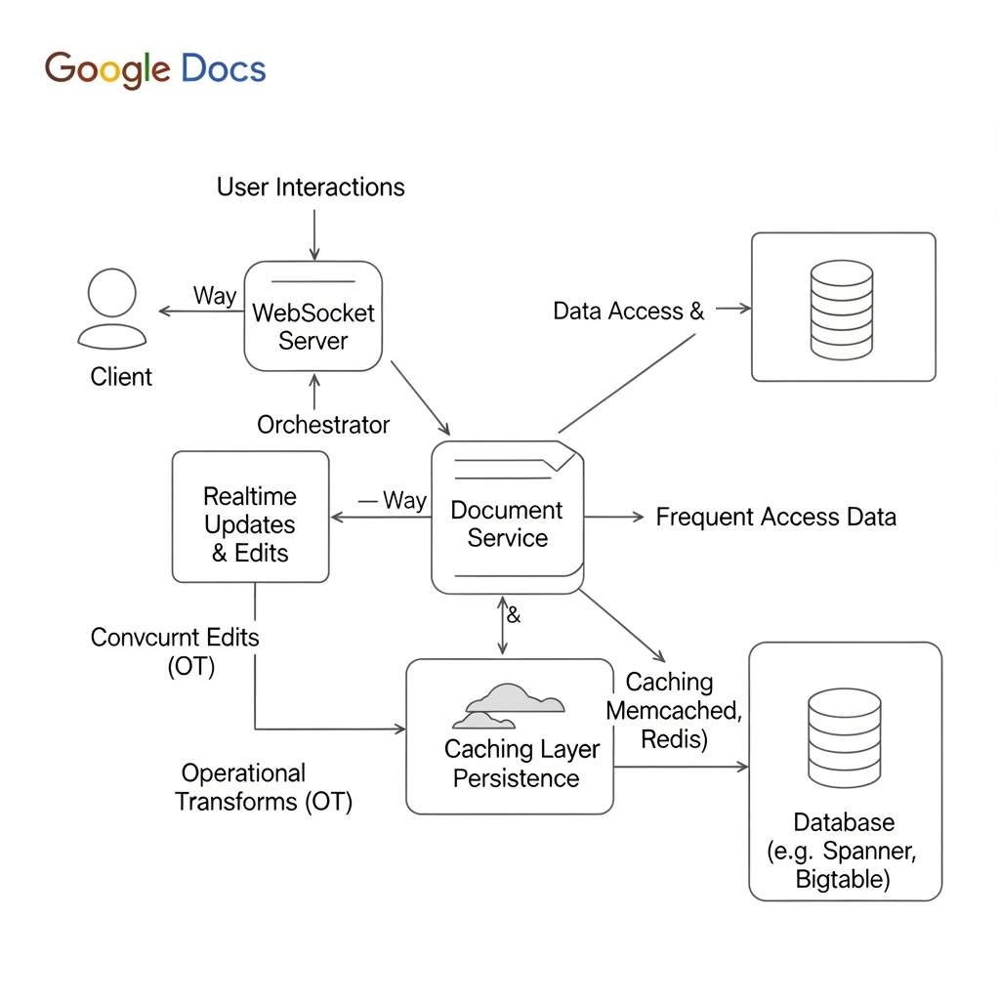

# System Design: Real-Time Collaborative Editor (Google Docs)

This repository contains a high-level technical design for a real-time collaborative document editing system, similar to Google Docs. It focuses on scalability, low latency, and the complex challenge of concurrent conflict resolution.

## 1. System Requirements

### Functional
* **Real-time Collaboration:** Multiple users editing the same document simultaneously.
* **Low Latency:** Changes must be visible to all collaborators in < 200ms.
* **Conflict Resolution:** No user's work should be unintentionally overwritten.
* **Persistence:** Documents must be saved durably.

### Non-Functional
* **High Availability:** The system must be available 24/7.
* **Scalability:** Must support millions of concurrent documents and users.
* **Consistency:** All users must eventually see the exact same state of the document.

---

## 2. High-Level Architecture

The architecture follows a microservices-based approach with persistent WebSocket connections for real-time data flow.

### Key Components:
1. **Load Balancer:** Distributes incoming WebSocket and HTTP traffic.
2. **WebSocket Server:** Maintains persistent bi-directional connections between the client and the backend.
3. **Document Service:** Orchestrates the business logic, handles session management, and interfaces with the transformation engine.
4. **OT Engine (Operational Transformation):** The core logic for merging concurrent edits from different users.
5. **Storage Layer:**
    * **Relational DB:** Metadata (user info, permissions).
    * **NoSQL/Append-only Log:** Stores document operations (keystrokes) and snapshots.
6. **Caching (Redis):** Stores active document states in memory for rapid access.

---

## 3. Conflict Resolution: Operational Transformation (OT)

To ensure consistency, this design utilizes **Operational Transformation**. Instead of sending the entire document, the client sends "Operations" (e.g., `Insert`, `Delete`, `Format`).

### How it works:
* **Client-side:** Applies changes locally immediately (Optimistic UI) and sends the operation to the server.
* **Server-side:** Receives operations, compares their version numbers, and **transforms** them against any concurrent operations that arrived first.
* **Broadcasting:** The server sends the *transformed* operation to all other clients so their local states converge.

---

## 4. Data Modeling
* **Operations Table:** `(doc_id, user_id, operation_type, position, value, version_number)`
* **Snapshot Table:** `(doc_id, version_number, content_blob)`
    * *Note: Snapshots are taken every N operations to allow for fast document loading without replaying the entire history.*

---

## 5. Scalability & Reliability
* **Sharding:** Data is sharded by `doc_id` to ensure that all collaborators for a single document are routed to the same processing cluster.
* **Replication:** Multi-region database replication ensures that documents are not lost if a data center fails.
* **Concurrency:** Uses a "Single Leader" per document to sequence operations and prevent race conditions during the transformation process.